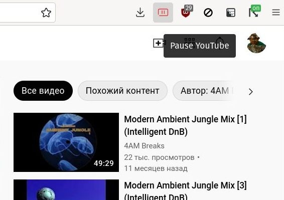

# YouTube Pauser
Plays / Pauses all active YouTube tabs upon clicking the extension icon

Available for [Firefox](https://addons.mozilla.org/en-US/firefox/addon/youtube-pauser/)

Works in Chrome as well, but uploading to Chrome Store now forces the usage of Manifest V3, and I can't be bothered 
juggling between versions to be honest
